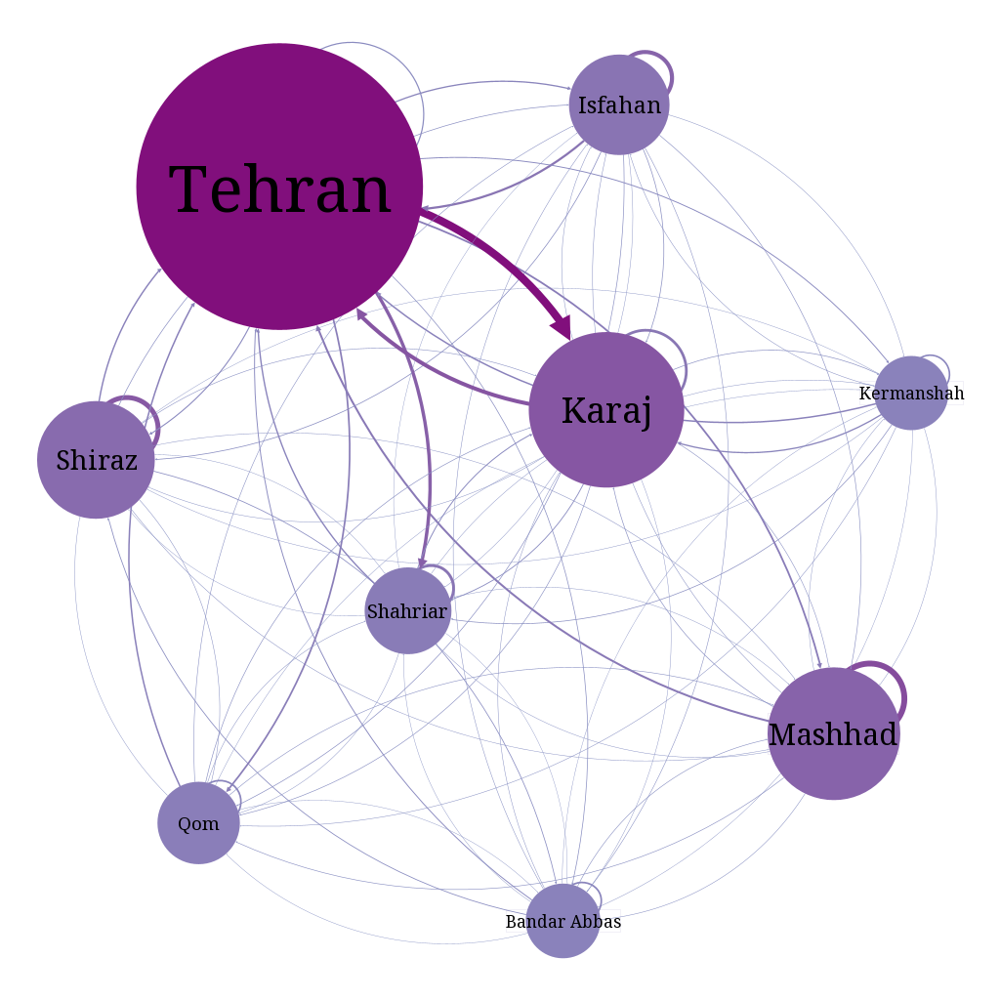

# A Structural Analysis of Iran's Migration Network

This repository presents a structural analysis of Iran's internal migration network at the inter-provincial and inter-county levels, based on data from the 2016 Iranian Population and Housing Census.

## Dataset

The data used in this analysis are derived from the Statistical Center of Iran's Population and Housing Census, specifically the dataset titled:

> "Migrants Arriving During the Previous Five Years by Previous and Current County of Residence (Migration Matrix): 1395"

Source: [Statistical Center of Iran](https://amar.org.ir/statistical-information/statid/22328)

## Execution

This project uses [`uv`](https://docs.astral.sh/uv/) for Python environment and dependency management.

Clone the repository and navigate to the project directory:

```bash
git clone https://github.com/lyzzzcat/ir-migration.git
cd ir-migration
```

Install the project dependencies and create the virtual environment:

```bash
uv sync
```

The main analysis is implemented as a Jupyter notebook:

```text
src/
└── ir_migration/
    └── main.ipynb
```

Launch Jupyter Lab using the project's environment:

```bash
uv run jupyter lab
```

Then open the following notebook and execute its cells sequentially:

```text
src/ir_migration/main.ipynb
```

The notebook reads the migration dataset from:

```text
dataset/migration_matrix.xlsx
```

and generates the analysis results in the `output/` directory.

